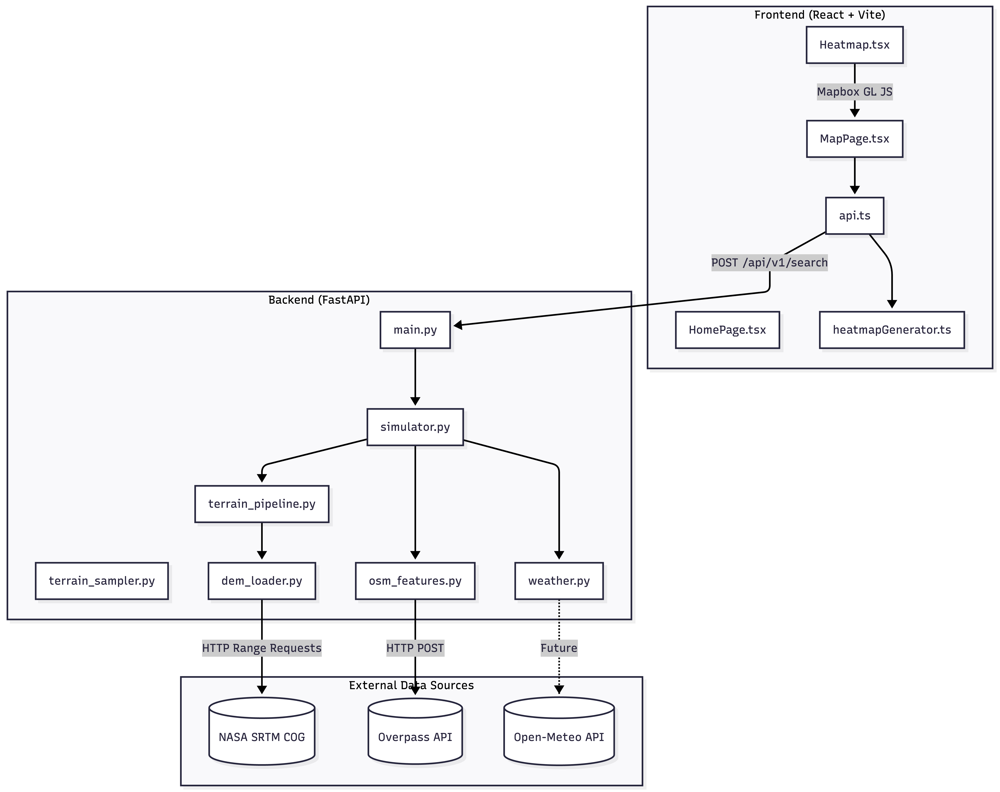
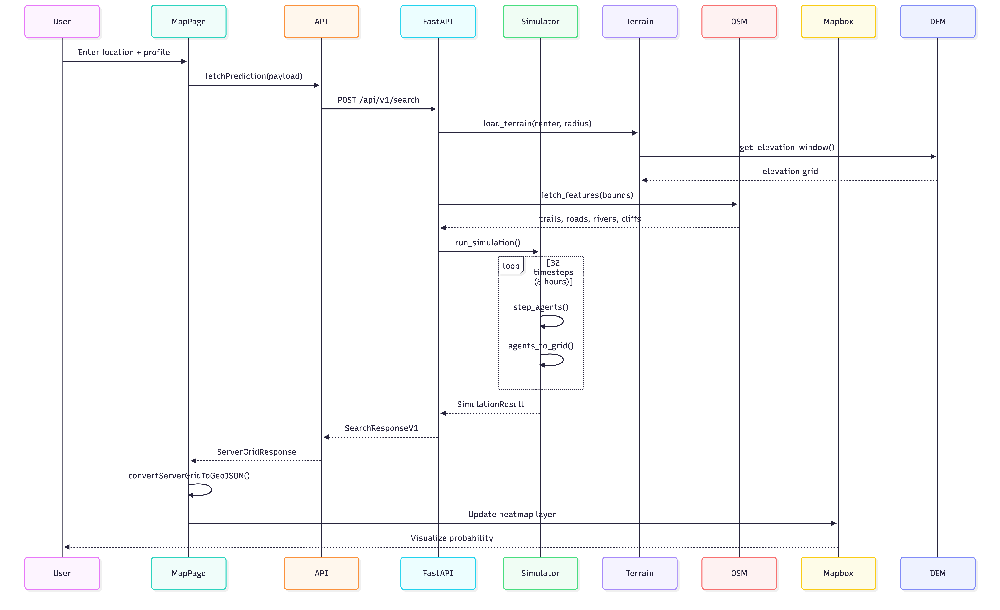

# Waypoint - Technical Context & System Architecture

> **AI-Powered Search and Rescue Prediction System**  
> Monte Carlo simulation for predicting probable locations of missing persons

---

## Table of Contents
1. [System Architecture](#system-architecture)
2. [Backend Deep-Dive](#backend-deep-dive)
3. [Frontend Deep-Dive](#frontend-deep-dive)
4. [Data Flow](#data-flow)
5. [Key Algorithms](#key-algorithms)
6. [Module Reference](#module-reference)

---

## System Architecture


### Component Overview

| Layer | Technology | Purpose |
|-------|------------|---------|
| **Frontend** | React 18 + Vite + TypeScript | Interactive map UI, form input, timeline playback |
| **Backend** | Python 3.11 + FastAPI | REST API, Monte Carlo simulation engine |
| **Visualization** | Mapbox GL JS | 3D/2D heatmap overlay on satellite terrain |
| **Data** | NASA SRTM, OpenStreetMap | Elevation (DEM), trails/roads/rivers |

---

## Backend Deep-Dive

### Entry Point: `main.py`

The FastAPI application defines three primary endpoints:

| Endpoint | Method | Description |
|----------|--------|-------------|
| `/api/v1/search` | POST | Run full Monte Carlo simulation, returns 50×50 probability grid at 15-min intervals |
| `/api/elevation` | GET | Query elevation at single lat/lon point |
| `/api/terrain` | POST | Get terrain metadata for an area |

**Request Flow:**
```
SearchRequest → HikerProfile → SARSimulator.run_simulation() → SimulationResult → SearchResponseV1
```

---

### Simulation Engine: `simulator.py`

The core Monte Carlo simulation with **1000 agents** (configurable).

#### Agent Model

```python
@dataclass
class Agent:
    id: int
    lat: float
    lon: float
    elevation: float
    strategy: Strategy      # Movement behavior type
    heading: float          # Direction in radians (0 = North)
    steps_taken: int = 0
    energy: float = 1.0     # 0-1, decreases over time
    is_active: bool = True
```

#### Movement Strategies (ISRID Research)

Agents are assigned strategies based on empirical probabilities from the International Search and Rescue Incident Database:

| Strategy | Probability | Behavior |
|----------|-------------|----------|
| `DIRECTION_TRAVELING` | 55.9% | Maintains fixed heading with ±8° variance |
| `ROUTE_TRAVELING` | 37.7% | Follows trails/roads (5× weight attraction) |
| `RANDOM_WALKING` | 5.5% | Random direction selection |
| `VIEW_ENHANCING` | 0.6% | Seeks high ground (3× uphill bias) |
| `STAYING_PUT` | 0.3% | 99% chance to stay stationary |

#### Step Function Logic

Each timestep (15 minutes):

1. **Time-Based Stop Check**
   - >4 steps (1hr): 0.5% stop probability
   - >20 steps (5hr): 2% stop probability  
   - >96 steps (24hr): 5% stop probability

2. **Direction Selection**
   - `DIRECTION_TRAVELING`: Use persistent heading + Gaussian noise (σ=0.15 rad)
   - Others: Weighted random from 8 directions based on terrain features

3. **Direction Weights Calculation**
   - **Slope bias**: Uphill +20% (general), +200% (VIEW_ENHANCING)
   - **Trail attraction**: +100% (general), +400% (ROUTE_TRAVELING)
   - **Water avoidance**: -90% weight
   - **Cliff avoidance**: -99% weight

4. **Speed Calculation (Tobler's Function)**
   ```python
   tobler_speed_kmh = 6 * exp(-3.5 * abs(slope + 0.05))
   final_speed = tobler_speed * profile_factor * (1 - weather_penalty) * energy
   ```

5. **Position Update**
   ```python
   distance_m = final_speed * timestep_seconds  # 900s = 15min
   new_lat = lat + dy * (distance_m / 111320.0)
   new_lon = lon + dx * (distance_m / (111320.0 * cos(lat)))
   ```

6. **Energy Decay**
   - Base cost: 0.5% per step
   - Uphill cost: +5% × slope

#### Output Generation

**Heatmap:** Agent positions → density grid → Gaussian smoothing (σ=0.5) → normalized 0-1

**Grid:** 50×50 probability matrix, cell (0,0) = Northwest corner

---

### Terrain Pipeline: `terrain_pipeline.py`

Loads and resamples DEM data for a search area.

```python
@dataclass
class TerrainModel:
    elevation_grid: np.ndarray  # 2D elevation (meters)
    center_lat: float
    center_lon: float
    radius_km: float
    resolution_m: float
    shape: Tuple[int, int]
    bounds: Tuple[float, float, float, float]  # (west, south, east, north)
    transform: rasterio.Affine
    crs: CRS
```

**Process:**
1. Compute bounding box (10% buffer)
2. Load DEM window from `dem_loader`
3. Compute target grid shape for resolution
4. Resample using bilinear interpolation

---

### DEM Loader: `dem_loader.py`

NASA SRTM Cloud-Optimized GeoTIFF loader with **LRU caching**.

**Key Features:**
- **Single-tile constraint**: Max radius ~35km (must fit in one 1°×1° tile)
- **In-memory LRU cache**: 4 tiles max, O(1) lookup after first load
- **Auto-download**: Fetches from `srtm-v3-1s.tif` COG via HTTP range requests
- **Session cleanup**: Optional deletion of downloaded tiles on shutdown

**Cache Key:** `(floor(lat), floor(lon))` → 1°×1° tile

```python
# Tile naming convention
tile_path = data_dir / f"merit_{lat}_{lon}.tif"
```

---

### Terrain Sampler: `terrain_sampler.py`

Efficient elevation and slope queries on loaded terrain.

**Methods:**
- `elevation(lat, lon)`: Bilinear interpolated elevation (meters)
- `slope(lat1, lon1, lat2, lon2)`: Rise/run between two points
- `slope_at_point(lat, lon)`: Gradient magnitude at point
- `slope_direction(lat, lon)`: Downhill unit vector

**Slope Grids:** Pre-computed using `np.gradient()` on first access.

---

### OSM Features: `osm_features.py`

Fetches spatial features from OpenStreetMap via Overpass API.

**Query Categories:**
- **Trails**: `highway=path|footway|track|bridleway`
- **Roads**: `highway=primary|secondary|tertiary|residential|unclassified`
- **Rivers**: `waterway=river|stream|creek` or `natural=water`
- **Cliffs**: `natural=cliff|bare_rock|scree`

**Rasterization:**
1. Create Shapely geometries from linestrings
2. Buffer by 10m (trails), 15m (roads), 20m (rivers)
3. Check point-in-polygon for each grid cell

```python
@dataclass
class FeatureMasks:
    trails: np.ndarray   # Boolean grid
    rivers: np.ndarray
    roads: np.ndarray
    cliffs: np.ndarray
    shape: Tuple[int, int]
    bounds: Tuple[float, float, float, float]
```

---

### Hiker Profile: `models.py`

Encapsulates missing person characteristics that affect simulation.

```python
class HikerProfile:
    age: Optional[int]
    gender: Gender  # MALE, FEMALE, OTHER, UNKNOWN
    skill_level: int  # 1-5
```

**Derived Properties:**

| Property | Formula | Effect |
|----------|---------|--------|
| `speed_factor` | Base (1.317 M, 1.241 F) - 0.012/decade × skill_multiplier | Walking speed m/s |
| `direction_randomness` | 1.0 - (skill_level - 1) × 0.2 | Movement variance |
| `trail_preference` | 0.8 (novice) / 0.5 (expert) | Trail attraction weight |

---

### Weather Conditions: `weather.py`

Currently a **placeholder** using elevation-based heuristics.

```python
class WeatherConditions:
    temperature_c: float    # Seasonal + diurnal + lapse rate
    precipitation_mm: float # >2000m elevation = light precipitation
    wind_speed_ms: float    # 3 + (elevation / 500)
```

**Movement Penalty:**
- Cold (<0°C): +20%
- Heat (>30°C): +20%
- Precipitation: +8%
- High wind (>10 m/s): +10%
- Cap: 80% max reduction

---

## Frontend Deep-Dive

### MapPage: `MapPage.tsx`

Main application interface with:
- **Sidebar**: Form for latitude, longitude, age, sex, experience, time last seen
- **Map**: Mapbox GL with heatmap overlay
- **Timeline**: Playback controls, 15-min interval slider

**State Management:**
```typescript
const [serverData, setServerData] = useState<ServerGridResponse | null>(null);
const [timeOffset, setTimeOffset] = useState(0);  // Minutes from last seen
const [isPlaying, setIsPlaying] = useState(false);
const [playbackSpeed, setPlaybackSpeed] = useState(1);  // 0.5x to 50x
```

**API Integration:** Uses TanStack Query `useMutation` for `fetchPrediction()`

---

### Heatmap Component: `Heatmap.tsx`

Mapbox GL JS integration with:
- **3D Mode**: `mapbox://styles/mapbox/standard` with 60° pitch
- **2D Mode**: Dark (`navigation-night-v1`) or Light (`streets-v12`)
- **Choropleth Layer**: Fill color interpolated from probability (0-1)

**Color Ramp:**
```
0.01 → Transparent
0.1  → Light Green (144,238,144)
0.25 → Green-Yellow (173,255,47)
0.4  → Yellow (255,255,0)
0.55 → Gold (255,215,0)
0.7  → Orange (255,165,0)
0.85 → Orange-Red (255,69,0)
1.0  → Crimson (220,20,60)
```

---

### Heatmap Generator: `heatmapGenerator.ts`

Converts server grid response to Mapbox GeoJSON.

**`ServerGridResponse` Schema:**
```typescript
interface ServerGridResponse {
  metadata: {
    grid_width: number;      // 50
    grid_height: number;     // 50
    cell_size_meters: number; // 500
    origin: { latitude: number; longitude: number };
  };
  predictions: {
    [minuteKey: string]: number[][];  // "0", "15", "30", ... "480"
  };
}
```

**Conversion:**
1. Calculate lat/lon step size from cell_size_meters
2. Find grid bounds centered on origin
3. For each cell with probability > 0.01, create GeoJSON Polygon feature
4. Return FeatureCollection

---

### Loading Animation: `LoadingAnimation.tsx`

3×3 grid animation with keyframe patterns:
1. Corners (0, 2, 6, 8)
2. Edges (1, 3, 5, 7)
3. All outer (0-3, 5-8)
4. None (blink)

Displays elapsed time and progressive messages.

---

## Data Flow

---

## Key Algorithms

### Tobler's Hiking Function

Models walking speed as a function of slope:

```
W = 6 × e^(-3.5 × |S + 0.05|)
```

Where:
- `W` = Walking speed (km/h)
- `S` = Slope (rise/run, positive = uphill)
- Optimal slope = -5% (slight downhill)

### Gaussian Smoothing

Applied to agent density grid before visualization:

```python
from scipy.ndimage import gaussian_filter
smoothed = gaussian_filter(density, sigma=0.5)
```

### Agent Boundary Check

Agents are deactivated if they exceed terrain bounds:

```python
if not (south <= new_lat <= north and west <= new_lon <= east):
    agent.is_active = False
```

---

## Module Reference

### Backend (`backend/app/`)

| File | Purpose |
|------|---------|
| `main.py` | FastAPI app, endpoints, CORS, lifespan |
| `config.py` | Settings via pydantic-settings (.env) |
| `simulation/simulator.py` | SARSimulator, Agent, AgentTracker |
| `simulation/models.py` | SearchRequest, HikerProfile, WeatherConditions |
| `simulation/weather.py` | WeatherService (placeholder) |
| `terrain/terrain_pipeline.py` | TerrainPipeline, TerrainModel |
| `terrain/terrain_sampler.py` | TerrainSampler |
| `terrain/osm_features.py` | OSMFeatureLoader, FeatureMasks |
| `dem/dem_loader.py` | MeritDEMLoader (SRTM COG) |
| `utils/logging.py` | RequestTimeMiddleware, timed_operation |

### Frontend (`frontend/src/`)

| File | Purpose |
|------|---------|
| `pages/HomePage.tsx` | Landing page, hero, features, citations |
| `pages/MapPage.tsx` | Main app: form, map, timeline |
| `components/Heatmap.tsx` | Mapbox GL wrapper |
| `components/LoadingAnimation.tsx` | Search loading overlay |
| `components/Card.tsx` | Feature card component |
| `components/Logo.tsx` | Logo SVG component |
| `api.ts` | fetchPrediction(), fallback to mock |
| `utils/heatmapGenerator.ts` | Grid→GeoJSON conversion, mock generator |
| `hooks/useScrollAnimation.ts` | Intersection observer hook |

---

## Configuration

### Backend (`backend/.env`)
```
DEM_DATA_DIR=../data/elevation/merit
NUM_AGENTS=1000
TIMESTEP_MINUTES=15
MAX_SIMULATION_HOURS=18
PARALLEL_AGENTS=true
MAX_WORKERS=2
```

### Frontend (`frontend/.env`)
```
VITE_MAPBOX_API_KEY=pk.xxx
VITE_API_BASE_URL=http://localhost:8000/api
```

---

## Performance Characteristics

| Operation | Typical Duration |
|-----------|-----------------|
| Terrain load (cached tile) | <10ms |
| Terrain load (download) | 2-5s |
| OSM feature fetch | 1-3s |
| Simulation (1000 agents, 32 steps) | 5-15s |
| Grid→GeoJSON conversion | <50ms |

---

*Built at DeltaHacks 2026*
